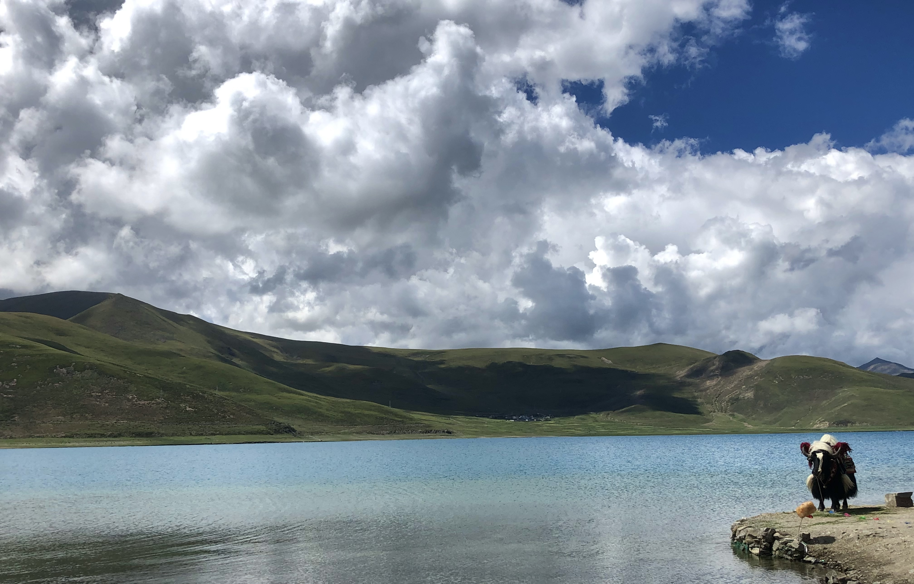
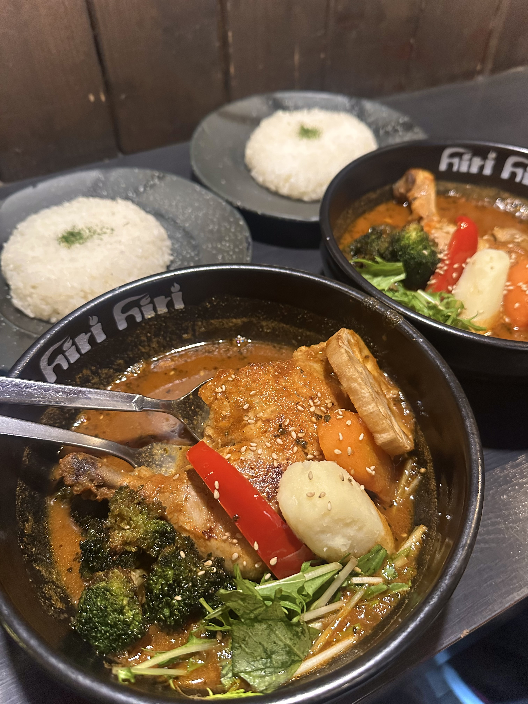

# 👋 About Me

Hello! I’m a graduate student at **Hokkaido University**, originally from **China**.  
I’m passionate about **urban planning**, **AI in architecture**, **gender and media**, **fake news**, and **fact-checking**.

---

## 📸 Travel & Food Gallery

### 🏞 Yamdrok Lake, Tibet

One of the three holy lakes in Tibet — a place of breathtaking beauty and serenity.

---

### 🍛 My Favorite Curry Spot in Sapporo

**Location:**  
〒060-0061 Hokkaido, Sapporo, Chuo Ward, Minami 1 Jonishi, 2 Chome 南一条Ｋビル B1F

